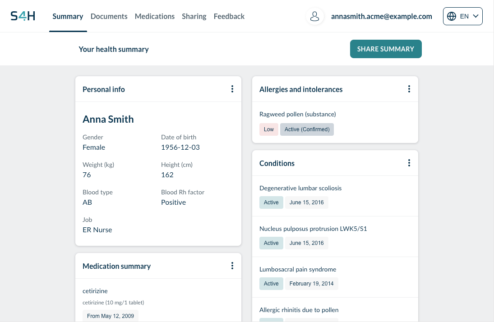
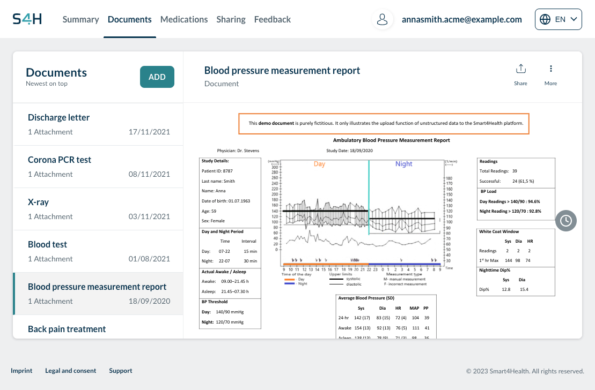
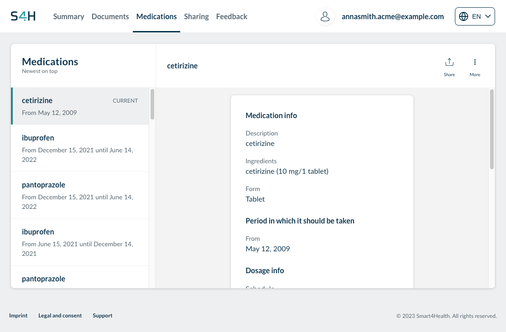
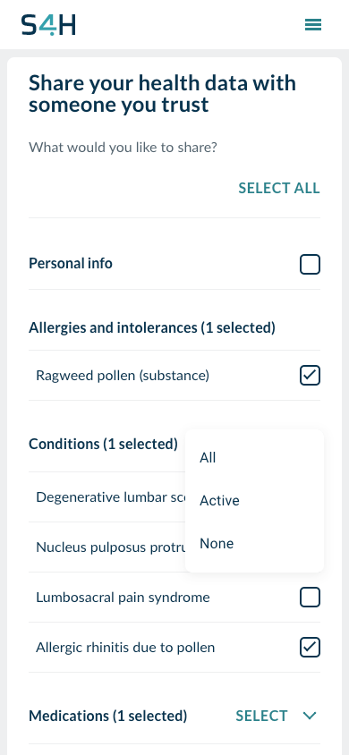
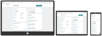

# Smart4Health User Portal


     
The Smart4Health User Portal is a web application that enables citizens to manage their health and health-related data.

1. [Features](#features)
2. [Implementation](#implementation)
3. [Usage](#usage)
4. [Acknowledgements](#acks)
5. [Further documentation](#docs)
6. [Contact](#contact)

## 1. Features <a name="features"></a>

With the User Portal, citizens can visualize electronic health records obtained from external data sources, in particular those of the **patient summary**.

<p align="center">

</p>     

Users can upload (and download) own **documents** such as X-rays, laboratory results or doctor's letters.

<p align="center">

</p>     

Users can access information from **medication statements** (e.g. from medication prescriptions), such its ingredients and intake form.

<p align="center">

</p>     

Through a secure data sharing mechanism, the users can enable others to access selected vital data via the web.

<p align="center">

</p>     


The User Portal was built to address user design requirements identified within the [Smart4Health](https://smart4health.eu) project and, above all, to put citizens in control of their health data. This includes:

* GDPR compliance (right to access, right to rectification, right to erasure, right to restriction of processing, right to object to the processing, and right to data transferability)
* Responsive design (mobile, tablet, desktop)
* Compatibility with standard and emerging vocabularies and terminologies in place in the EU
* Ready for integration with open-source web analytics frameworks (Matomo)
* Support for multiple languages (currently EN, DE, PT, FR, NL, IT provided)


_Figure: Responsive design :arrow_up:_


## 2. Implementation <a name="implementation"></a>

The User portal was implemented as a single-page application using a variety of technologies:
* [React JS](https://reactjs.org/) to build the user interfaces
* [React JSX](https://www.w3schools.com/react/react_jsx.asp) to write HTML in React
* [React Hooks](https://reactjs.org/docs/hooks-intro.html) to decouple unrelated logic from lifecycle methods, [React Lazy](https://reactjs.org/docs/code-splitting.html) and [React suspense](https://17.reactjs.org/docs/concurrent-mode-suspense.html) to reduce the Time to Interactive
* The Javascript [Web SDK](https://github.com/d4l-data4life/js-sdk) to interact with the Citizen Health Data Platform as the backend
* A FHIR transformation library (described below)


## 3. Usage <a name="usage"></a>

This repository consists of two components:

1. [`s4h-fhir-xforms`](s4h-fhir-xforms/README.md), which is a FHIR transformation library
2. [`s4h-citizen-app`](s4h-citizen-app/README.md), which is the top-level application

### 3.1. `s4h-fhir-xforms`

#### 3.1.1. Building

The objective is to create a JavaScript module bundle that can be used as a browser library.
[Webpack](https://webpack.js.org/) is used for module bundling.

```sh
npm install
npm run build:prod
```

You can find the bundle in the folder `./dist`.

#### 3.1.2. Testing

We use Karma for testing in a (headless) browser.

```sh
npm install
npm run test
```

There are `:w` suffixed scripts that watch the sources and re-run when changes are detected.
The following environment variables are honored by the test runner:
- `DUMP`: If set to 1 there will be verbose output of the test cases.
- `DOT`: If set to a URL of a [graph rendering service](./tools/graph-svc), one can render FHIR resource dependency graphs for debugging.
- `BROWSER`: Overrides the default browser (`ChromeHeadless`) for testing (you might need to install additional packages when choosing another test environment).
- `SUITE`: Select which test suites are run (defaults to `all`). See [karma.config.js](./karma.config.js) for details.

### 3.2. `s4h-citizen-app`

This project uses [npm](https://www.npmjs.com/) as the dependency manager.

#### 3.2.1. Building

You have to install all dependencies for both components: the backend and the frontend (SPA).

`s4h-fhir-xforms` is required by the frontend.
You must `npm link` to the local version of it, since it has not been released into a public `npm` registry. 

```sh
cd ./s4h-citizen-app
npm install
cd ./client
npm install --link ../../s4h-fhir-xforms
```

Below we present the build commands.

##### 3.2.1.1. JavaScript

```sh
npm run build
```

##### 3.2.1.2. Docker

```sh
make docker-build
```

The base image used in the Dockerfile and for E2E tests are pulled from Docker.


### 3.2.2. Local Deployment

Upon successful compilation, all the application sources together with static resources such as images, style sheets, fonts, and any code system definitions are served by a [Node.js](https://nodejs.org/en/) HTTP server using the [Express](https://expressjs.com/) middleware stack.
This allows for flexible routing and middlewares for tasks such as cookie handling, session management, content security policies, and logging.

Active OAuth client credentials are required for users to authorize and access the Citizen Health Data Platform (CHDP). 
If you want to test the User Portal together with the CHDP, please reach out to <ToDo>

For test purposes, you can use only locally valid OAuth client credentials, e.g. `OAUTH_CLIENT_ID=123 OAUTH_CLIENT_SECRET=test`

Run `OAUTH_CLIENT_ID=<client ID> OAUTH_CLIENT_SECRET=<secret> make docker-run` to start the User Portal in a Docker container.

## 4. Acknowledgements <a name="acks"></a>


This project has received funding from the European Union’s Horizon 2020 research and innovation programme under grant agreement No 826117.


## 5. Further documentation <a name="docs"></a>

* The Smart4Health project [website](https://smart4health.eu).
* Report on the development of the 4HealthNavigator User Portal. _Available at EC's site of research results, [CORDIS](https://ec.europa.eu/research/participants/documents/downloadPublic?documentIds=080166e5e17f665d&appId=PPGMS)._

## 6. Contact <a name="contact"></a>

For further information on the usage of the system, as well as for possibilities to operate an instance of the Citizen Health Data Platform as backend, please reach out to <s4h-contact@data4life.care>.
