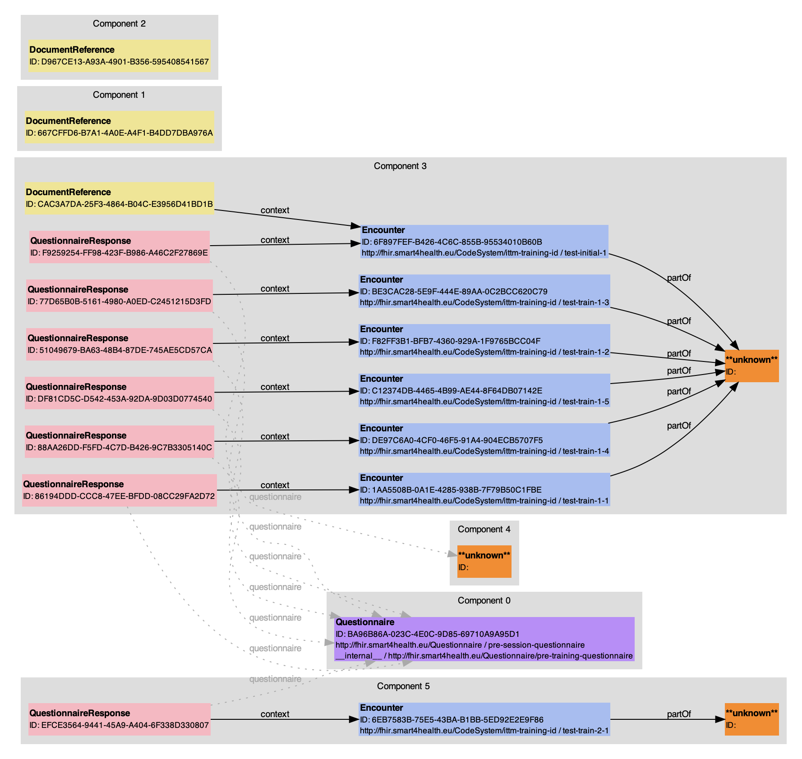
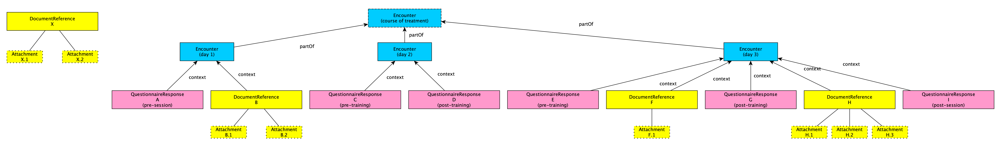

# Group list model derivation

Function `apiReadGroupList` which is exported from [src/lib.ts](../src/lib.ts) implements the following pipeline.

## Pipeline

```
               +---------------+
               | Array of data |
               +---------------+
                       |
                       |  (A)
                       V
+-------------------------------------------------+
| Array of validated and supported FHIR resources |
+-------------------------------------------------+
                       |
                       |  (A2)
                       V
         +----------------------------+
         | Resolved codeable concepts |
         +----------------------------+
                       |
                       |  (B)
                       V
           +-------------------------+
           | Graph of FHIR resources |
           +-------------------------+
                       |
                       |  (C)
                       V
       +----------------------------------+
       | Disconnected components of graph |
       +----------------------------------+
                       |
                       |  (D)
                       V
                   +--------+
                   | Groups |
                   +--------+
                       |
                       |  (E)
                       V
         +-----------------------------+
         | Groups with sections merged |
         +-----------------------------+
                       |
                       |  (F)
                       V
         +----------------------------+
         | Add group item short texts |
         +----------------------------+
                       |
                       |  (G)
                       V
         +--------------------------+
         | Remove redundant answers |
         +--------------------------+
```

### Step (A): Parse and validate resources

The input array is checked for valid and supported FHIR resources.
Runtime type validation is done using [io-ts](https://github.com/gcanti/io-ts).
The types are maintained in [src/fhir-resources](../src/fhir-resources).

### Step (A2): Resolve codeable concepts

Most of the resources' nominal properties (such as `type` or `category`) are represented by [CodeableConcept](https://www.hl7.org/fhir/datatypes.html#codeableconcept) data types.
This step resolves (some of) those properties to human-readable strings which are used in subsequent steps.
The resolution is done by checking an internal list of frequently needed codings.
The precise resolution logic is described [here](./codeable-concept-resolution.md).

### Step (B): Build graph

Each FHIR resource that makes it through step A becomes a node in a [graph](../src/fhir-resources/utils/graph/index.ts).
References between resources become the edges of the respective nodes.
Edges are labeled by a _type_ which corresponds to the FHIR reference name (that is, there are `context` edges, `partOf` edges, etc.)

### Step (C): Find graph's disconnected components

The [disconnected components](https://en.wikipedia.org/wiki/Component_(graph_theory)) (w.r.t. edges to type `context` and `partOf`) become candidates for `Group` derivation.
The following image depicts an example graph with four components that will become groups.



### Step (D): Derive groups

The subgraphs induced by the components of Step (C) are fed into a sequence of functions that try to derive a `Group` instance from them. The output of the first successful function form the resulting group.
Those derivation functions are in folder [stage-d-derive-groups](../src/transformations/group-list/fhir2ui/stage-d-derive-groups).
See below for a detailed example.

### Step (E): Merge group items

Each group's items are revisited and `QuestionnaireGroupItem`s that meet the following criteria are merged into the `sections` of a new `QuestionnaireGroupItem`:

- Items are of type `QuestionnaireGroupItem`.
- Items were derived from FHIR `QuestionnaireResponse` resources which referenced the same `Encounter` resource.
- Items were derived from FHIR `QuestionnaireResponse` resources with identical integer answers to the item with `linkId='training_no'`.
- Items were derived from FHIR `QuestionnaireResponse` resources whose referenced `Questionnaire` resources had one of the following type (that is, `url` property):
  - `http://fhir.smart4health.eu/Questionnaire/pre-training-questionnaire`
  - `http://fhir.smart4health.eu/Questionnaire/post-training-questionnaire`

The sections of such a new group item are ordered by the dates of the original items with items preceding all others if no date was present.

### Step (F): Impute item short texts

- If a group item has one section with a pre-session questionnaire response, set the thumbnail text to `Pre`.
- If a group item has one section with a post-session questionnaire response, set the thumbnail text to `Post`.
- If a group item was merged (step E), its thumbnail text is set to the stringified training number.

### Step (G): Remove answers

An optional string array can be supplied when the transformation function is called.
All responses with a `linkId` in that array are removed (for all sections of all group items of all groups).

----

# Input/output mappings

This document illustrates how the input FHIR resources and the output UI resources are related to each other.

## Input

Let's assume a scenario as depicted below:



- Each solid box represents a FHIR resource that is fed into the FHIR2UI function.
- Dashed boxes may be missing in the input.
- Dotted boxes represent FHIR resources that are contained in others (`Attachment` in `DocumentReference`).
- The edges are imputed by the FHIR2UI function and are taken from references (edges are labeled by the FHIR reference name).
- FHIR `Questionnaire` resources are omitted for brevity. Each `QuestionnaireResponse` would reference one.

That is, the FHIR2UI function would get as input an arbitrarily ordered array of 18 resources:
14 depicted in the figure, plus four assumed Questionnaire resources which are not depicted.


## Output

The output UI model would look like this:

```
GroupList: [

  Group: { // DocumentReference X
    groupType: "Document"
    id:        <DocumentReference.id>
    title:     f(DocumentReference.description, DocumentReference.type, DocumentReference.category)
    date:      <DocumentReference.date>
    items: [   // one item per attachment
      FileGroupItem { // X.1
        type:   "File"
        id:     <DocumentReference.id>
        date:   <DocumentReference.date>
        fileId: <DocumentReference.content[1].attachment.id>
        docRefType: resolved display text of <DocumentReference.type>
        category:   resolved display texts of <DocumentReference.category>
      },
      FileGroupItem { // X.2
        type:   "File"
        id:     <DocumentReference.id>
        date:   <DocumentReference.date>
        fileId: <DocumentReference.content[2].attachment.id>
        docRefType: resolved display text of <DocumentReference.type>
        category:   resolved display texts of <DocumentReference.category>
      }
    ]
  },

  Group {
    groupType:     "Course",
    id:          // random UUID
    date:        // maximum date of all items
    courseTypes: [ "$$BACK_PAIN_TREATMENT$$" ],
    items: [   // one or more(!) entries for resources A to I
               // items ordered by date
      QuestionnaireGroupItem { // A
        type:   "Questionnaire"
        id:     <QuestionnaireResponse.id>
        date:   <QuestionnaireResponse.authored>
        sections: [
          QuestionnaireSection {
            title: <QuestionnaireResponse.questionnaire -> Questionnaire.title>
            type:  <QuestionnaireResponse.questionnaire -> Questionnaire.url>
            questionnaireId: <QuestionnaireResponse.questionnaire -> Questionnaire.id>
            questionnaireResponseId: <QuestionnaireResponse.id>
            responses: [ // one entry per answer in FHIR QuestionnaireResponse
                         // (note the clash of notion: FHIR QuestionnaireResponse != UI QuestionnaireResponse)

              ScaleResponse { ... },
              ScaleResponse { ... },
              TextResponse  { ... }
            ]
          }
        ]
      },

      // A single DocumentReference contributes a GroupItem for each attachment
      FileGroupItem { // B.1
        type:   "File"
        id:     <DocumentReference.id>
        date:   <DocumentReference.date>
        fileId: <DocumentReference.content[1].attachment.id>
        docRefType: resolved display text of <DocumentReference.type>
        category:   resolved display texts of <DocumentReference.category>
      },

      FileGroupItem { // B.2
        type:   "File"
        id:     <DocumentReference.id>
        date:   <DocumentReference.date>
        fileId: <DocumentReference.content[2].attachment.id>
        docRefType: resolved display text of <DocumentReference.type>
        category:   resolved display texts of <DocumentReference.category>
      },

      QuestionnaireGroupItem { // C + D
        type:   "Questionnaire"
        id:     // random UUID
        date:   <QuestionnaireResponse.authored> of C
        sections: [
          QuestionnaireSection {
            title: <QuestionnaireResponse.questionnaire -> Questionnaire.title>
            type:  <QuestionnaireResponse.questionnaire -> Questionnaire.url>
            questionnaireId: <QuestionnaireResponse.questionnaire -> Questionnaire.id>
            questionnaireResponseId: <QuestionnaireResponse.id>
            responses: [ responses of resource C ]
          },
          QuestionnaireSection {
            title: <QuestionnaireResponse.questionnaire -> Questionnaire.title>
            type:  <QuestionnaireResponse.questionnaire -> Questionnaire.url>
            questionnaireId: <QuestionnaireResponse.questionnaire -> Questionnaire.id>
            questionnaireResponseId: <QuestionnaireResponse.id>
            responses: [ responses of resource D ]
          }
        ]
      },

      QuestionnaireGroupItem { // E + G
        type:   "Questionnaire"
        id:     // random UUID
        date:   <QuestionnaireResponse.authored> of E
        sections: [
          QuestionnaireSection {
            title: <QuestionnaireResponse.questionnaire -> Questionnaire.title>
            type:  <QuestionnaireResponse.questionnaire -> Questionnaire.url>
            questionnaireId: <QuestionnaireResponse.questionnaire -> Questionnaire.id>
            questionnaireResponseId: <QuestionnaireResponse.id>
            responses: [ responses of resource E ]
          },
          QuestionnaireSection {
            title: <QuestionnaireResponse.questionnaire -> Questionnaire.title>
            type:  <QuestionnaireResponse.questionnaire -> Questionnaire.url>
            questionnaireId: <QuestionnaireResponse.questionnaire -> Questionnaire.id>
            questionnaireResponseId: <QuestionnaireResponse.id>
            responses: [ responses of resource G ]
          }
        ]
      },

      FileGroupItem { // F.1
        type:   "File"
        id:     <DocumentReference.id>
        date:   <DocumentReference.date>
        fileId: <DocumentReference.content[1].attachment.id>
        docRefType: resolved display text of <DocumentReference.type>
        category:   resolved display texts of <DocumentReference.category>
      },

      FileGroupItem { // H.1
        type:   "File"
        id:     <DocumentReference.id>
        date:   <DocumentReference.date>
        fileId: <DocumentReference.content[1].attachment.id>
        docRefType: resolved display text of <DocumentReference.type>
        category:   resolved display texts of <DocumentReference.category>
      },

      FileGroupItem { // H.2
        type:   "File"
        id:     <DocumentReference.id>
        date:   <DocumentReference.date>
        fileId: <DocumentReference.content[2].attachment.id>
        docRefType: resolved display text of <DocumentReference.type>
        category:   resolved display texts of <DocumentReference.category>
      },

      FileGroupItem { // H.3
        type:   "File"
        id:     <DocumentReference.id>
        date:   <DocumentReference.date>
        fileId: <DocumentReference.content[3].attachment.id>
        docRefType: resolved display text of <DocumentReference.type>
        category:   resolved display texts of <DocumentReference.category>
      },

      QuestionnaireGroupItem { // I
        type:   "Questionnaire"
        id:     <QuestionnaireResponse.id>
        date:   <QuestionnaireResponse.authored>
        sections: [ { ... } ]
      }

    ]
  }
]
```
The above-sketched example would yield the following UI model:

- The are two `Group`s.
- The first `Group` has two `GroupItem`s, one per `Attachment` of the `DocumentReference`.
- The second `Group` has 10 `GroupItem`s:
  - Four `QuestionnaireGroupItem`s: two of them resulted from merging: `{ A, {C, D}, {E, G}, I }`
  - One for each `Attachment` of the three `DocumentReference`s: 2 + 1 + 3
